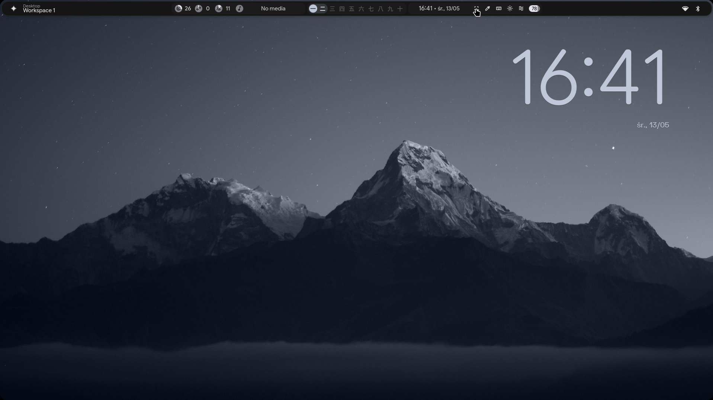
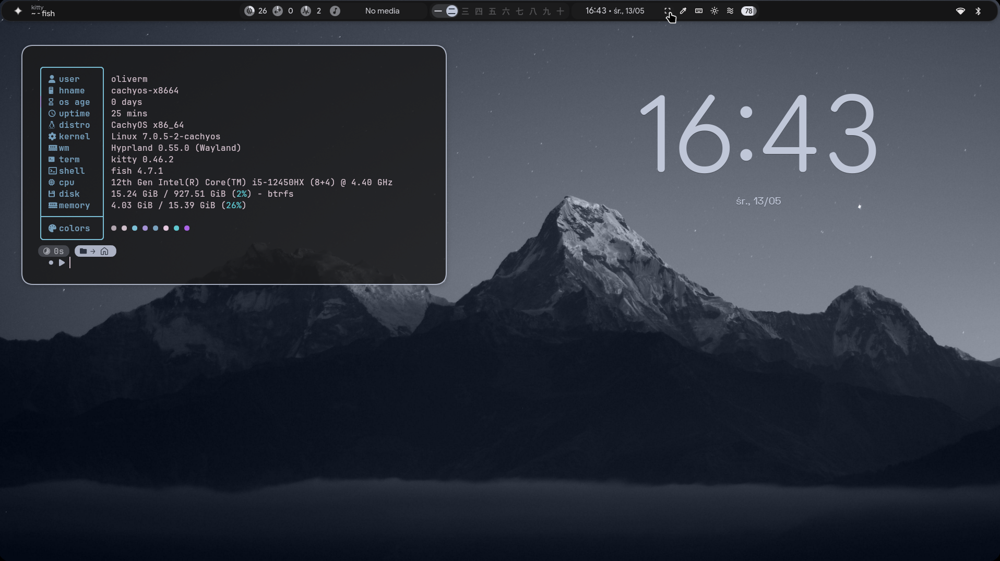

<div align="center">
    <h1>【 devdad's dotfiles 】</h1>
    <h3></h3>
</div>

<div align="center">
    <i>A fork of <a href="https://github.com/end-4/dots-hyprland">end-4/dots-hyprland</a> with personal customizations</i>
</div>

<br>

<div align="center">
    
</div>

<br>

<div align="center">
    
</div>

---

## What's different from upstream

- Custom nvim, fastfetch, tmux, and yazi configs
- Modified Hyprland config
- Personal wallpaper collection

## Installation

Clone the repo and run:

```bash
./setup install
```

> This is a fork. All credit for the original dotfiles system goes to [end-4](https://github.com/end-4).
